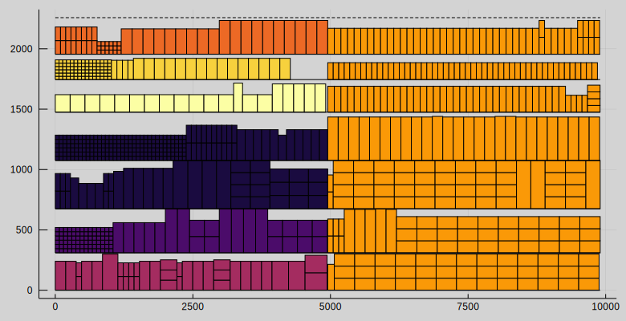

# Shelf Space Allocation


This package implements a Mixed Integer Linear Programming (MILP) formulation that solves the Shelf Space Allocation Problem (SSAP). In SSAP, a set of products is placed on a set of shelves while optimizing for the objective without violation constraints. Both, constraints and the objective are partially design decisions. The implementation presented here is created in the context of retail stores.

This package is a part of a research project in the Systems Analysis Laboratory at Aalto University, Finland. The authors of the package are *Jaan Tollander de Balsch*
and *Fabricio Oliveira*.


## Dependencies
This package depends on [Julia Language](https://julialang.org/) version 1.0. It also depends on the following Julia packages:

- JuMP.jl -- Modeling language for mathematical optimization. Used for formulating the Shelf Space Allocation Problem (SSAP) as a Mixed Integer Linear Program (MILP).
- CSV.jl -- Reading and writing input files in CSV format.
- JSON.jl -- Reading and writing results from the optimization into JSON files.
- Plots.jl -- For plotting the results as planograms and other plots. Allows saving plots into SVG files.


## Usage with Gurobi Backend
JuMP requires an optimizer backend to perform the actual optimization. Gurobi is a popular commercial optimizer which provides a free academic license. Gurobi can be interfaced with Julia using [Gurobi.jl](https://github.com/JuliaOpt/Gurobi.jl). Here are the steps to install Julia and Gurobi in order to run the program:

1) Download [**Julia Language**](https://julialang.org/) for your platform. Make sure that Julia can be found in the path by typing `julia` in the terminal. If Julia REPL doesn't open, add the Julia binaries to the path by appending `export PATH="<path>/julia-1.0.0/bin:$PATH` to `.bashrc` file located in the home directory. Replace `<path>` with the path where the binaries are located and the version number with the version you downloaded.

2) Obtain a license of **Gurobi** and install Gurobi solver by following the instructions on [Gurobi's website](http://www.gurobi.com/).

3) Make sure the `GUROBI_HOME` environmental variable is set to the path of the Gurobi directory. This is part of standard installation. The Gurobi library will be searched for in `GUROBI_HOME/lib` on Unix platforms and `GUROBI_HOME\bin` on Windows. If the library is not found, check that your version is listed in `deps/build.jl`. The environmental variable can be set by appending `export GUROBI_HOME="<path>/gurobi811/linux64"` to `.bashrc` file. Replace the `<path>`, platform `linux64` and version number `811` with the values of your Gurobi installation.

<!-- TODO: In Julia REPL run `using Pkg; Pkg.build("Gurobi")` -->

4) Navigate to `examples` directory and run `julia script.jl`.


## Documentation
The project documentation is created using [Documenter.jl](https://juliadocs.github.io/Documenter.jl/stable/). In order to build the documentation, navigate inside the `docs` directory and run the command
```bash
julia make.jl
```
