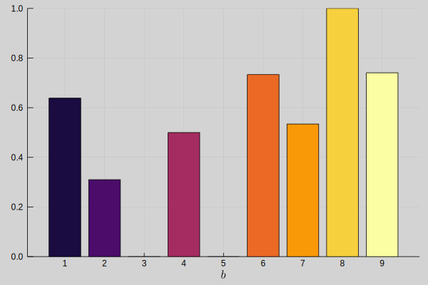

# Plotting
This section illustrates the results of the optimization model using visualizations implemented with `Plots.jl`.

```@example plots
using ShelfSpaceAllocation
output_dir = joinpath("output", "exact", "medium")
parameters = load_json(Params, joinpath(output_dir, "parameters.json"))
variables = load_json(Variables, joinpath(output_dir, "variables.json"))
nothing; #hide
```

```@example plots
m = parameters.modules[1]
println(parameters.modules)
```

## Planogram
```@example plots
plot_planograms(parameters, variables)[m]
```

Planogram visualizes the product placing on the shelves. Blocks are indicated by the different colors.

Block allocation visualizes the block starting location $x_{b,s}$ and block width $b_{b,s}$ for each block and for each shelf.

- [`plot_planogram`](@ref)
- [`plot_planograms`](@ref)
- [`plot_planogram_no_blocks`](@ref)
- [`plot_planograms_no_blocks`](@ref)


## Product Facings
```@example plots
plot_product_facings(parameters, variables)
```

Visualizes the number of product facings $∑_s n_{p,s}$ allocated per product. The opaque color indicates the maximum number of facings $N_p^{max}$ allowed per product.

[`plot_product_facings`](@ref)


## Demand and Sales
```@example plots
plot_demand_and_sales(parameters, variables)
```

Visualizes the sales $s_p$ per product. The opaque color indicates the demand $D_p$ per product.

[`plot_demand_and_sales`](@ref)


## Demand-Sales Percentage
```@example plots
plot_demand_sales_percentage(parameters, variables)
```

$$\sum_{p∈P_b} s_p / \sum_{p∈P_b} D_p$$


## Allocation Amount
```@example plots
plot_allocation_amount(parameters, variables)
```

Allocation amount visualizes the total amount of products facings $∑_{p∈P_b,s∈S} n_{p,s}$ allocated to the shelves per block.

[`plot_allocation_amount`](@ref)


## Allocation Percentage


Allocation percentage visualizes the relative amount of product facings allocated to the shelves per block. Calculated by dividing the absolute amount of product facing allocated per block by the number of products that could be allocated to the shelves per block if there were no products from other blocks.

[`plot_allocation_percentage`](@ref)
